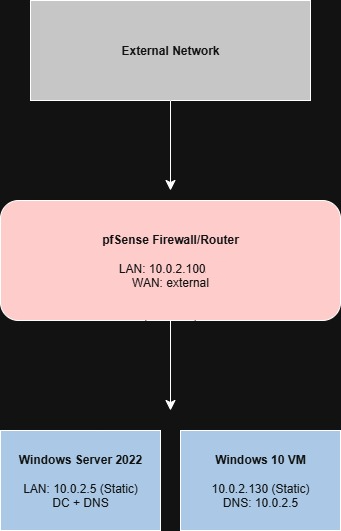
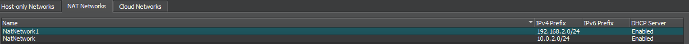
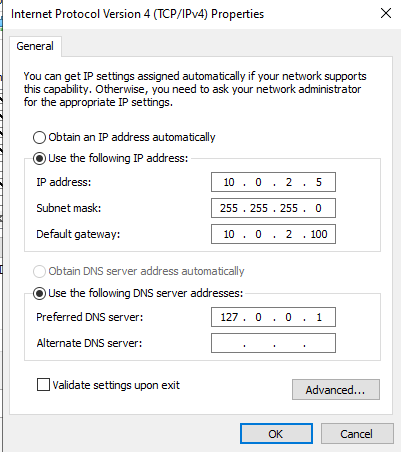
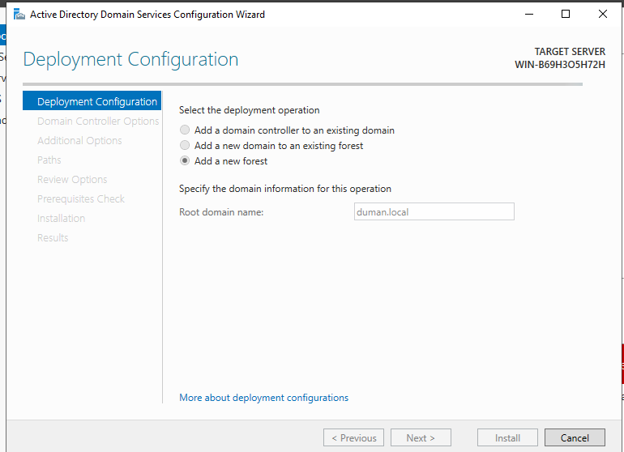
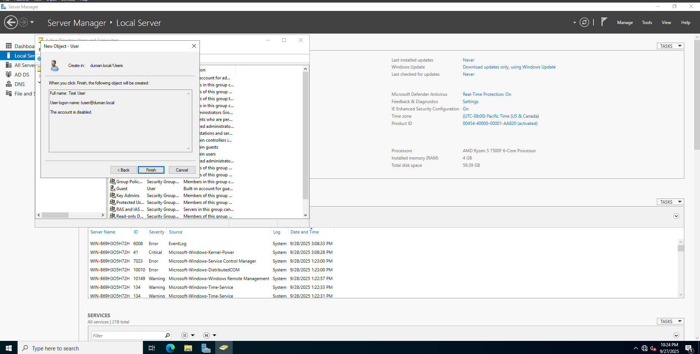
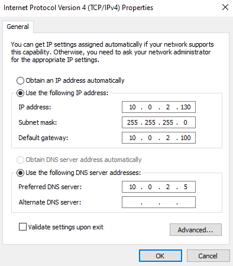
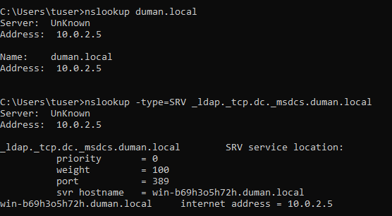
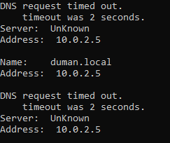

## 1. Project Overview

This project builds on my previous work where I set up a Windows 10 virtual machine and a pfSense firewall in a virtualised lab environment. The new objective was to extend the environment by deploying a Windows Server 2022 Domain Controller (DC) with Active Directory Domain Services (AD DS) and DNS, then join the Windows 10 client VM to the domain through the pfSense firewall.

---

## 2. Network Topology

---

## 3. Environment & Tools

- **pfSense CE:** 2.8.1-RELEASE  
  - LAN: `10.0.2.100` (Default Gateway)  
  - WAN: external  
- **VirtualBox:** 7.0.12  
- **Windows Server 2022** (Domain Controller)  
  - Hostname: `WIN-B69H3O5H72H`  
  - IP: `10.0.2.5` (Static)  
  - Roles: AD DS, DNS  
- **Windows 10:** Version 22H2 (OS Build 19045.3803)  
  - IP: `10.0.2.130` (Static)  
  - DNS: `10.0.2.5`  

---

## 4. Setup Steps

1. **Configured VirtualBox Networks**  
   - pfSense given **two NICs**: one for WAN (External), one for LAN (`10.0.2.0/24`)  
   - Windows Server and Windows 10 joined to the **LAN** (NatNetwork)  
   

2. **Installed Windows Server 2022**  
   - Assigned static IP: `10.0.2.5`  
   - Promoted to Domain Controller with AD DS and DNS  
   - Created domain: **duman.local**  
   - Created a test domain user  
     
     
   

3. **Configured Windows 10 Client**  
   - Assigned static IP: `10.0.2.130`  
   - DNS manually pointed to: `10.0.2.5` (DC)  
   - Successfully joined domain: **duman.local**  
     
     

---

## 5. Testing & Validation

- **DNS Resolution:** Verified that the DC resolved `duman.local` and SRV records (`_ldap._tcp.dc._msdcs.duman.local`)  
  
- **Domain Join:** Confirmed that Windows 10 joined `duman.local` using domain admin credentials  
- **Connectivity:** Tested client ↔ DC ↔ pfSense gateway using `ping` and `nslookup`  
- **Firewall Path:** Verified that all LAN traffic flowed through pfSense at `10.0.2.100`  

---

## 6. Lessons Learned

### Challenges & Solutions

- **DNS Resolution Issues:** Initially `nslookup` failed due to misconfigured forwarders and multiple NICs on the DC. Fixed by cleaning up interfaces and setting forwarders correctly.  
  
- **Client Join Errors:** Resolved by pointing the Windows 10 client DNS strictly to the DC.  

### Future Improvements

- Automate configuration with PowerShell scripts for DC and client setup.  
- Add Group Policy Objects (GPOs) to enforce domain-wide settings.  
- Expand the environment with additional client VMs to simulate multiple users.  

---
